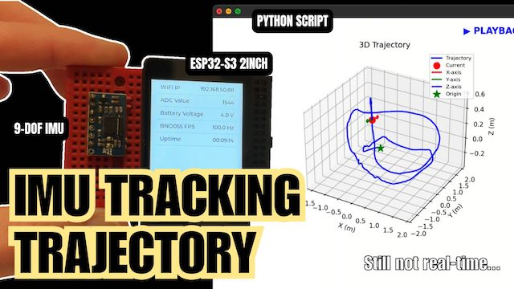
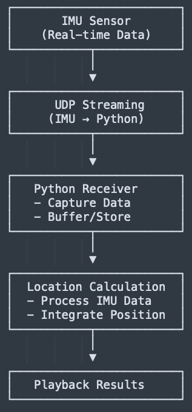
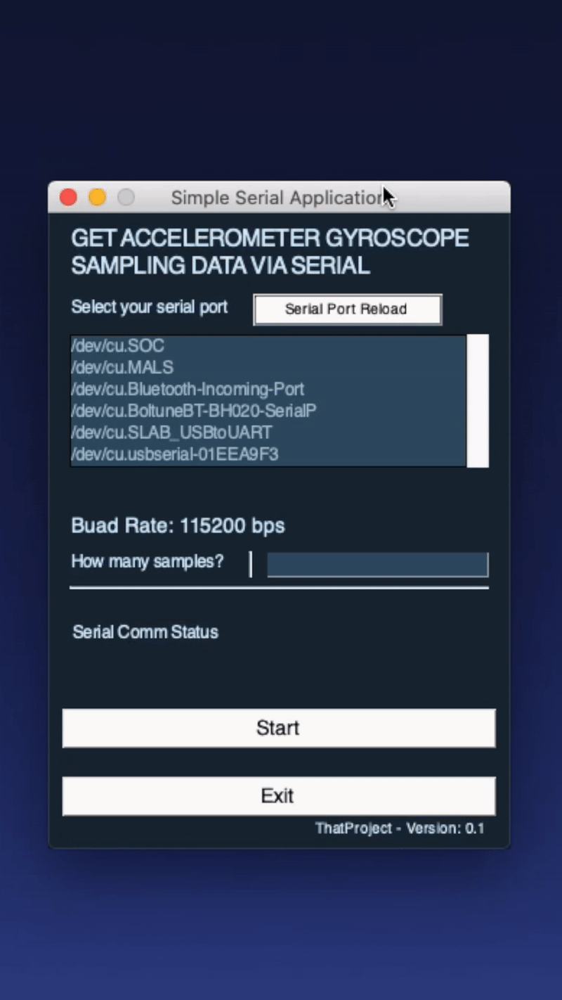

# Python IMU Data Sampling Application

This repository contains two IMU data collection and processing applications:

## 1. UDP Server with x-IMU Motion Tracking (NEW)

Offline motion tracking using x-IMU algorithm with BNO055 IMU sensor. Records IMU data via UDP protocol and performs post-processing to reconstruct 3D trajectory.

[](https://youtu.be/RUpNuuojN5Q)

*Based on the x-IMU algorithm from [xioTechnologies/Oscillatory-Motion-Tracking-With-x-IMU](https://github.com/xioTechnologies/Oscillatory-Motion-Tracking-With-x-IMU)*

### System Overview



### Features
- Real-time UDP data reception from ESP32/BNO055
- Automatic sensor calibration
- x-IMU MATLAB-based offline motion tracking algorithm
- Post-processing trajectory reconstruction with animated playback
- 3D trajectory visualization with orientation display
- Multiple view perspectives (3D, top, side, front)
- ZUPT (Zero Velocity Update) for drift correction
- Interactive playback controls

### Requirements
```bash
pip install -r requirements.txt
```

### Usage
```bash
python udp_server_ximu.py
```

**Controls:**
- Press 'R' to start recording (after calibration)
- Press 'T' to stop recording and process trajectory (Replay animation)
- Press 'C' to clear data

### Configuration
- UDP Port: 5000
- Sample Rate: 100 Hz
- Calibration: 200 samples (automatic)

### ESP32-S3 Firmware
- `ESP32-S3_IMU_Client/` - ESP-IDF project for ESP32-S3 with BNO055 sensor (UDP client)

---

## 2. Serial Data Sampling App (Legacy)



GUI-based application for saving accelerometer and gyro readings from BNO055 or MPU6050 via Serial Communication to CSV files.

### Features
- PySimpleGUI interface
- Serial port auto-detection
- Configurable sample count
- CSV export
- Real-time sampling rate display

### Requirements
```bash
cd serial_app
pip install -r requirements.txt
```bash
cd serial_app
python main.py
```

### Arduino Firmware
- `ESP32_GY-BNO055/` - BNO055 sensor firmware (Serial)
- `ESP32_MPU6050/` - MPU6050 sensor firmware (Serial)

---

## Firmware

### Arduino
- `serial_app/ESP32_GY-BNO055/` - BNO055 sensor firmware (Serial)
- `serial_app/ESP32_MPU6050/` - MPU6050 sensor firmware (Serial)

## More Information
* [IMU | Ep.1: Preparing an experiment to test linear positions (ft. MPU6050, GY-BNO055)][[Video]](https://youtu.be/3-IBOJ5FQvI)

### Created & Maintained By
[Eric Nam](https://github.com/0015)
([Youtube](https://www.youtube.com/channel/UCRr2LnXXXuHn4z0rBvpfG7w))
([Facebook](https://www.facebook.com/groups/138965931539175))

## License

Copyright (c) 2021 - 2025 Eric N

Permission is hereby granted, free of charge, to any person obtaining
a copy of this software and associated documentation files (the
"Software"), to deal in the Software without restriction, including
without limitation the rights to use, copy, modify, merge, publish,
distribute, sublicense, and/or sell copies of the Software, and to
permit persons to whom the Software is furnished to do so, subject to
the following conditions:

The above copyright notice and this permission notice shall be
included in all copies or substantial portions of the Software.

THE SOFTWARE IS PROVIDED "AS IS", WITHOUT WARRANTY OF ANY KIND,
EXPRESS OR IMPLIED, INCLUDING BUT NOT LIMITED TO THE WARRANTIES OF
MERCHANTABILITY, FITNESS FOR A PARTICULAR PURPOSE AND
NONINFRINGEMENT. IN NO EVENT SHALL THE AUTHORS OR COPYRIGHT HOLDERS BE
LIABLE FOR ANY CLAIM, DAMAGES OR OTHER LIABILITY, WHETHER IN AN ACTION
OF CONTRACT, TORT OR OTHERWISE, ARISING FROM, OUT OF OR IN CONNECTION
WITH THE SOFTWARE OR THE USE OR OTHER DEALINGS IN THE SOFTWARE.


